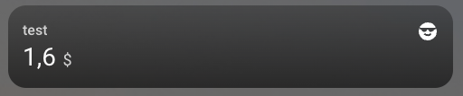

[](https://github.com/hacs/integration)


# Home Assistant - Basic Sensor
A basic home-assistant integration providing a single sensor that auto increments its value.

## Installation
Manually add this repository by using the "three-dots-menu" at the top right in HACS.

## Configuration
Add the following snippet to your `configuration.yaml`
```
sensor:
    - platform: kartax_basic_sensor
      name: test
      icon: mdi:emoticon-cool
      unit_of_measurement: $
```

## Screenshot
